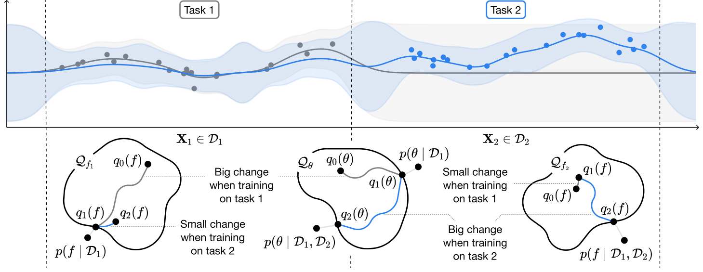
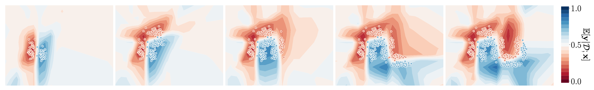

# Continual Learning via Sequential Function-Space Variational Inference (S-FSVI)

This repository contains the official implementation for

**_Continual Learning via Sequential Function-Space Variational Inference_**; Tim G. J. Rudner, Freddie Bickford Smith, Qixuan Feng, Yee Whye Teh, Yarin Gal. **ICML 2022**.

**Abstract:** Sequential Bayesian inference over predictive functions is a natural framework for continual learning from streams of data. However, applying it to neural networks has proved challenging in practice. Addressing the drawbacks of existing techniques, we propose an optimization objective derived by formulating continual learning as sequential function-space variational inference. In contrast to existing methods that regularize neural network parameters directly, this objective allows parameters to vary widely during training, enabling better adaptation to new tasks. Compared to objectives that directly regularize neural network predictions, the proposed objective allows for more flexible variational distributions and more effective regularization. We demonstrate that, across a range of task sequences, neural networks trained via sequential function-space variational inference achieve better predictive accuracy than networks trained with related methods while depending less on maintaining a set of representative points from previous tasks.

<p align="center">
  &#151; <a href="https://timrudner.com/sfsvi"><b>View Paper</b></a> &#151;
</p>

In particular, this codebase includes:
- An implementation of the sequential function-space variational objective [1];
- **Notebooks that reproduce the results in the paper;**
- A general, easy-to-extend continual learning training and evaluation protocol;
- A set of framework-agnostic dataloader methods for widely used continual learning tasks;

[1] The implementation is based on the approximation proposed in <a href="https://timrudner.com/fsvi">**_Tractable Function-Space Variational Inference in Bayesian Neural Networks_**</a> (Rudner et al., 2022).

<br>
<br>

<p align="center">
  <br>
  <b>Figure 1.</b> Schematic of sequential function-space variational inference.
</p>


[//]: # (>📋 [todo] figure 1, and explanation for our approach)


## Installation

To install requirements:

```setup
$ conda env update -f environment.yml
$ conda activate fsvi
```

This environment includes all necessary dependencies.

To create an `fsvi` executable to run experiments, run `pip install -e .`.


## Reproducing results

[//]: # (To train the model&#40;s&#41; in the paper, run this command:)

[//]: # ()
[//]: # (```train)

[//]: # (python train.py --input-data <path_to_data> --alpha 10 --beta 20)

[//]: # (```)

[//]: # ()
[//]: # (>📋  Describe how to train the models, with example commands on how to train the models in your paper, including the full training procedure and appropriate hyperparameters.)


[//]: # (## Pre-trained Models)

[//]: # ()
[//]: # (You can download pretrained models here:)

[//]: # ()
[//]: # (- [My awesome model]&#40;https://drive.google.com/mymodel.pth&#41; trained on ImageNet using parameters x,y,z.)

[//]: # ()
[//]: # (>📋  Give a link to where/how the pretrained models can be downloaded and how they were trained &#40;if applicable&#41;.  Alternatively you can have an additional column in your results table with a link to the models.)

### Split MNIST, Permuted MNIST, and Split FashionMNIST

| Method               | [Split MNIST (MH)](https://github.com/timrudner/S-FSVI/blob/main/notebooks/split_mnist_multihead.ipynb) <br/>[](https://colab.research.google.com/github/timrudner/S-FSVI/blob/main/notebooks/split_mnist_multihead.ipynb) | [Split FashionMNIST (MH)](https://github.com/timrudner/S-FSVI/blob/main/notebooks/split_fashionmnist_multihead.ipynb) <br/> [](https://colab.research.google.com/github/timrudner/S-FSVI/blob/main/notebooks/split_fashionmnist_multihead.ipynb)| [Permuted MNIST (SH)](https://github.com/timrudner/S-FSVI/blob/main/notebooks/permuted_mnist_singlehead.ipynb) <br/> [](https://colab.research.google.com/github/timrudner/S-FSVI/blob/main/notebooks/permuted_mnist_singlehead.ipynb) | [Split MNIST (SH)](https://github.com/timrudner/S-FSVI/blob/main/notebooks/split_mnist_singlehead.ipynb) <br/> [](https://colab.research.google.com/github/timrudner/S-FSVI/blob/main/notebooks/split_mnist_singlehead.ipynb) |
|--------------------------|----------------------------------------------------------------------------------------------------------------------------------------------------------------------------------------------------------------------------------------------------------------------------------------------------------------------|------------------------------------------------------------------------------------------------------------------------------|-----------------------------------------------------------------------------------------------------------------|-----------------------------------------------------------------------------------------------------------|
| S-FSVI (ours)            | 99.54% &pm; 0.04                                                                                                                                                                                                                                                                                                     | 99.05% &pm; 0.03                                                                                                             | 95.76% &pm; 0.02                                                                                                | 92.87% &pm; 0.14                                                                                          |
| S-FSVI (larger networks) | 99.76% &pm; 0.00                                                                                                                                                                                                                                                                                                     | 98.50% &pm; 0.11                                                                                                             | 97.50% &pm; 0.01                                                                                                | 93.38% &pm; 0.10                                                                                          |
| S-FSVI (no coreset)      | 99.62% &pm; 0.01                                                                                                                                                                                                                                                                                                     | 99.17% &pm; 0.06                                                                                                             | 84.06% &pm; 0.46                                                                                                | 20.15% &pm; 0.52                                                                                          |
| S-FSVI (minimal coreset [2]) | NA [3]                                                                                                                                                                                                                                                                                                               | NA [3]                                                                                                                       | 89.59% &pm; 0.30                                                                                                | 51.44% &pm; 1.22                                                                                          |

[2] "Minimal coresets" are constructed by randomly selecting one data point per class for a given task.

[3] Since S-FSVI already performs well without a coreset, the minimal coreset option is not useful.


### Split CIFAR

| Method               | [Split CIFAR (MH)](https://github.com/timrudner/S-FSVI/blob/main/notebooks/split_cifar_multihead.ipynb) <br/> [](https://colab.research.google.com/github/timrudner/S-FSVI/blob/main/notebooks/split_cifar_multihead.ipynb) |
|--------------------------|---------------------------------------------------------------------------------------------------------------------------------------------------------------------------------------------------------------------------------------------------------------------------------------------------------------------|
| S-FSVI [4]            | 77.57% &pm; 0.84                                                                                                                                                                                                                                                                                                    |

### Sequential Omniglot


| Method               | [Sequential Omniglot (MH)](https://github.com/timrudner/S-FSVI/blob/main/notebooks/sequential_omniglot_multihead.ipynb) <br/> [](https://colab.research.google.com/github/timrudner/S-FSVI/blob/main/notebooks/sequential_omniglot_multihead.ipynb) |
|--------------------------|-------------------------------------------------------------------------------------------------------------------------------------------------------------------------------------------------------------------------------------------------------------------------------------------------------------------------------|
| S-FSVI [4]            | 83.29% &pm; 1.2                                                                                                                                                                                                                                                                                                               |

[4] To speed up training and reduce the memory requirements, only the variance parameters in the final layer of the network are learned variationally and the linearization is computed on the final layer only.


### 2D Visualization

[This notebook](https://github.com/timrudner/S-FSVI/blob/main/notebooks/toy2d.ipynb)  [](https://colab.research.google.com/github/timrudner/S-FSVI/blob/main/notebooks/toy2d.ipynb) demonstrates continual learning via S-FSVI on a sequence of five binary-classification tasks in a 2D input space.

<p align="center">
  <br>
  <b>Figure 2.</b> Predictive distributions of a model trained via S-FSVI on tasks 1-5.
</p>


## Adding new methods or tasks

- To implement a new method, create a file `method_cl_methodname.py` in `/benchmarking`. For reference, see `/benchmarking/method_cl_template.py` and `/benchmarking/method_cl_fsvi.py`.
- To implement a new dataloader, add a new method to `benchmarking/data_loaders`.


## Citation

```
@InProceedings{rudner2022continual,
      author={Tim G. J. Rudner and Freddie Bickford Smith and Qixuan Feng and Yee Whye Teh and Yarin Gal},
      title = {{C}ontinual {L}earning via {S}equential {F}unction-{S}pace {V}ariational {I}nference},
      booktitle ={Proceedings of the 39th International Conference on Machine Learning},
      year = {2022},
      series ={Proceedings of Machine Learning Research},
      publisher ={PMLR},
}
```

Please cite our paper if you use this code in your own work.
